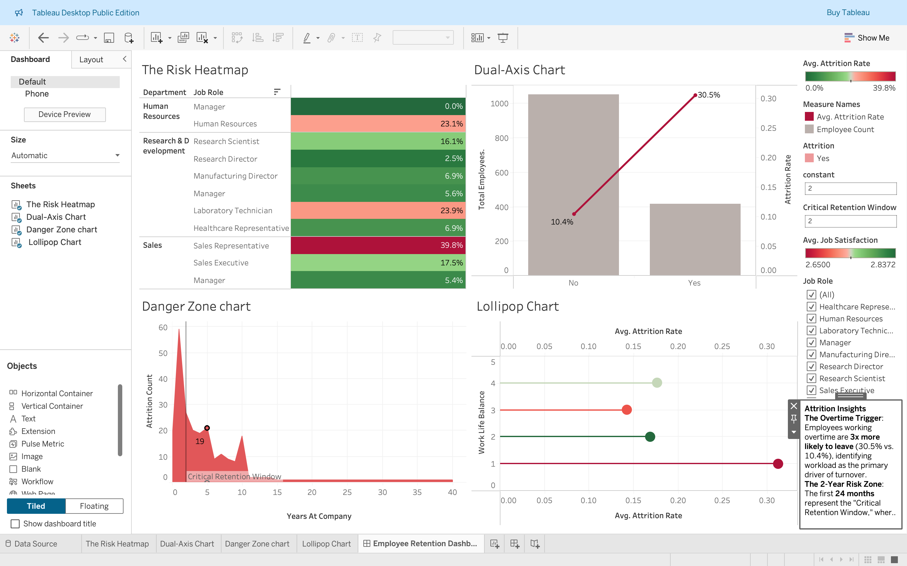

# Workforce Analytics: HR Attrition & Retention Strategy

🔗  [View Live Tableau Dashboard Here](https://public.tableau.com/app/profile/amulya.v.murthy/viz/EmployeeRetentionDashboard_17727141412210/EmployeeRetentionDashboard)

## 📌 The Problem

High employee turnover is a hidden cost that impacts productivity and morale. Executives need to identify if attrition is driven by workload (burnout), specific tenure milestones (onboarding issues), or a broader culture gap. Analyzing raw HR data manually is insufficient for identifying these complex, intersecting variables.

## ⚙️ The Solution

I developed an end-to-end analytics pipeline that transforms raw HR records into an interactive executive dashboard. This project provides actionable insights into the "Who, Why, and When" of employee turnover to inform better retention policies.

### The Workflow:

1.  **SQL (Extract):** : Leveraged SQL to engineer metrics such as Attrition Rate and Employee Count, ensuring data was aggregated correctly for dual-axis comparisons.
2.  **Python (Clean):** Implemented automated preprocessing to handle schema inconsistencies and prepare the dataset for Tableau's visualization engine.
3.  **Tableau (Visualize):** Designed a 4-part interactive dashboard focusing on Risk Mapping,Workload Analysis,Tenure Trends,
Culture Gap

### 📊 Dashboard Preview

### 🛠️ How to Run

1.Clone this repo.
2.Download the [ibm-hr-analytics-attrition-dataset](https://www.kaggle.com/datasets/pavansubhasht/ibm-hr-analytics-attrition-dataset).
3.Run python3 main.py to generate the final processed data.

